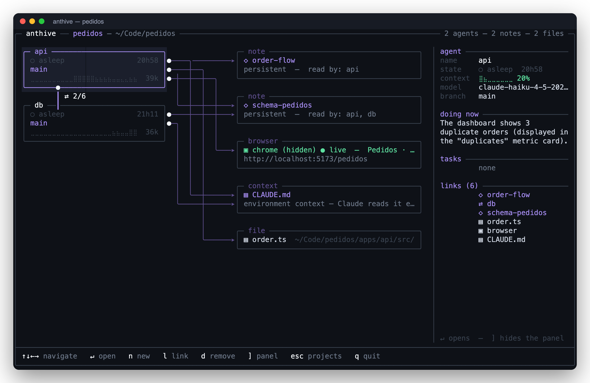
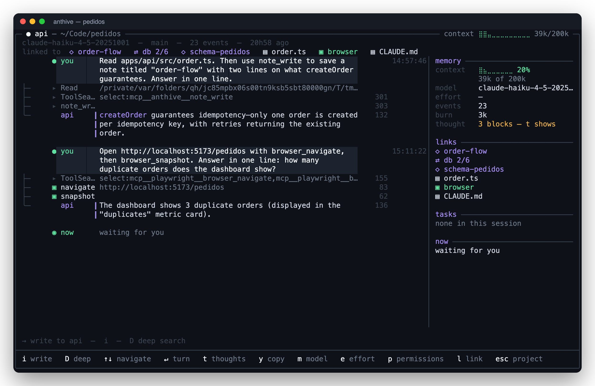
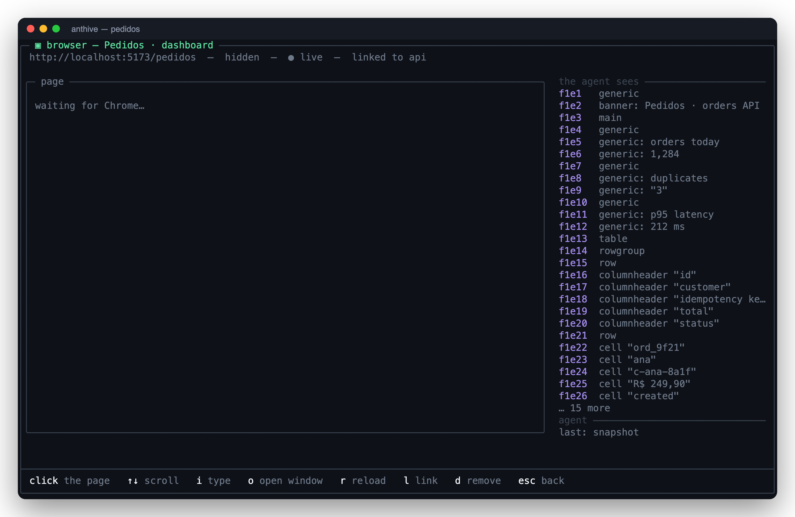

# Anthive

**An ant hive for your Claude Code agents.** A live map of agents, notes, memory, services and a browser — all linked, all in the terminal.

[](https://github.com/andre2654/anthive/actions/workflows/ci.yml)
[](https://github.com/andre2654/anthive/releases)
[](LICENSE)



Run five Claude Code agents on the same project. See what each one is doing, what it reads, who it talks to. Pin a note to an agent, hand it a file, point it at a service that is running on your machine. Give it a browser and **watch the page render live inside your terminal** — then click on it yourself.

No web app, no Electron, no tmux. One binary, your own Claude subscription.

## Install

macOS (Apple Silicon or Intel). You need [Claude Code](https://docs.anthropic.com/en/docs/claude-code) installed and logged in.

```bash
curl -fsSL https://raw.githubusercontent.com/andre2654/anthive/main/install.sh | sh
```

Add `--alias` (`sh -s -- --alias`) to also get `ai` as a shortcut. Then:

```bash
anthive doctor   # what this machine has: Claude Code, Chrome, terminal images…
anthive          # the projects screen
```

From source: `bun install && bun run build` (Bun ≥ 1.3).

For the live browser image you need a terminal that speaks the Kitty graphics protocol: [Ghostty](https://ghostty.org), kitty or WezTerm. Everything else works in any terminal.

## 60-second tour

1. **Projects.** `n` creates one (a name and a directory). `↵` opens it.
2. **The map.** Agents on the left, everything else on the right, links drawn between them. `n` adds an agent, a note, a file, a service running on this machine, a browser, or the project's `CLAUDE.md`. `l` links the selected node to another one. `↵` opens it. `]` toggles the side panel. What the agents produced appears on its own: files written by a tool, by a shell redirect or found on disk, grouped by folder, linked to whoever made them. When there is room left, a history strip below the map tells the last hour of the project: turns, subagents, files written. Boxes grow with the terminal, so what an agent is doing is not cut in half on a wide screen.
3. **An agent** is a named Claude Code session. Open it: a chat with the whole transcript as a tree, markdown, the agent's thinking (`t`), the diffs of every edit (`↵` on an Edit), and a panel with context usage, links and tasks. Prose wraps at a readable measure however wide the terminal is. `ctrl-v` pastes the image on your clipboard into the turn, shown as a thumbnail above the box. `m`/`e`/`p` switch model, effort and permission mode mid-session. Hover a message with the mouse and it lights up with `y copies` at its edge; `y` copies that block and flashes it, `Y` copies the whole turn; `s` freezes the frame, redraws the transcript with no frame, gutter or panel, and gives the mouse back to the terminal, so selecting by hand copies the text alone. `D` (or Tab in the box) turns the turn into a **deep search**: the agent fans out Explore subagents over the repo, searches the hive with `project_search`, hits the web with WebSearch/WebFetch, and saves a sourced report as a `research:` note linked to it. When an agent fans out subagents, they hang under it on the map: the name, what each one is doing right now, tokens so far, and a red `orphan` the moment the process that was running them is gone. `↵` opens one as a read-only transcript that follows it live, without touching the chat that runs it. Inside the chat they get their own panel section, and the live line counts them: a subagent writing a long report is silent for minutes, which is not a freeze.

   

4. **A new agent reads the map first.** It gets a briefing of the project — the other agents, notes, files, services — and decides what to link to before touching the request. If the repo has no `CLAUDE.md`, it generates one with `/init` and links it to every agent.
5. **Agents talk to each other** through a small MCP bus: notes with access lists and TTLs, threads with a mandatory goal and a turn budget (only you can extend it), and everything another agent wrote arrives framed as data, not instructions.
6. **The browser.** `n → browser`, link an agent to it, open the chat. The agent gets `browser_*` tools; you get the page.



## The browser, in detail

Anthive owns the Chrome. It starts a Chrome for Testing (the Playwright one, or your Google Chrome) with a profile of its own and a fixed debugging port. The agent's Playwright MCP does not launch a browser; it connects to that Chrome over CDP. Anthive reads the **same page** over CDP: a screencast drawn into the terminal with the right aspect ratio, plus click, scroll and typing from the terminal.

- **hidden** (default): headless. No window, no Dock icon, nothing steals focus. The page lives in the terminal.
- **window**: `o` switches to a real Chrome window that opens without stealing focus. Same profile, logins kept, the agent reconnects by itself.

The agent is told how to use it: snapshot first (the accessibility tree with refs), refs as selectors, screenshots only for layout, never close the browser on its own — and that the page is shared with you.

## Approvals

Agents run in Claude Code's print mode, which cannot ask you anything: a tool that is not pre-allowed is refused with "requires approval". Anthive routes those prompts to itself (`--permission-prompt-tool`): the request pops up on the map as a modal with the agent's name and the exact command, with a bell. `y` allows it once, `a` allows and remembers a rule for that agent (`Bash(python3 scripts/report.py:*)`, kept in the project and added to the allowlist next time the chat starts), `l` allows and links the file the command touches to the agent, `t` trusts the agent — everything it asks from now on is allowed, and its next chats start in bypass mode (`p` → "ask again" revokes it, rules included), `n` denies, `esc` postpones (the agent keeps waiting). For web tools "always" means the whole tool (`WebSearch(*)`) or the site (`WebFetch(https://x.com:*)`). Closing a chat (`x`), quitting (`q`) or changing model, effort or permissions mid-turn would kill the process and every subagent with it, so `x` and `q` ask first and the settings wait for the answer before restarting. The map says `approval` only while a request is actually pending; a tool still running (a subagent, a long command) shows as `running` with the tool's name. Two things never ask: a remembered rule, and a command that touches a file already linked to the agent — linking a file is how you tell an agent it may work on it. A request nobody answers is denied after 15 minutes (`ANTHIVE_APPROVAL_TIMEOUT`, in ms).

## Deep search

In an agent's chat, `D` opens the input box with the `[deep]` chip on (Tab toggles it). That turn goes out as `Deep search: …` to a process that has the web tools and read-only git in its allowlist, `--forward-subagent-text` so the subagents' progress shows indented in the tree, and effort `max` unless you picked one. The first time the chip goes on for a live chat, the chat restarts once in the same session (nothing is lost). The protocol the agent follows: plan, fan out in parallel (Explore subagents over the repo, `project_search` over the hive, WebSearch then WebFetch on primary sources, the project browser when linked), iterate, synthesize with confidence per finding and inline citations, and record the report with `note_write` as `research: <topic>` — the answer names the note. Subagents always run synchronously: a chat can be restarted at any moment (model, effort, the `[deep]` chip) and background subagents die with the process — the tree marks any launched in the background in amber. The web tools stay allowed until the chat closes (`x`); `max` sticks until `e`. There is no spending cap: a deep search runs as many rounds, subagents and pages as the question needs. `ANTHIVE_DEEP_BUDGET_USD=3` caps a deep process at that many dollars if you want one (once hit, the process refuses turns until `x`/`i`).

`project_search` is also there for the agents themselves: notes and threads they are allowed to read, and the transcripts of every agent of the project (the newest 128 MB of each, up to 40 transcripts, every block uncut), up to 200 matches grouped by source, everything written by others framed as data.

## How it works

- **Own renderer.** A character grid with per-cell colors, frame diffing and mouse hit-testing. No curses, no React. The whole UI is ~5k lines of TypeScript on Bun, compiled to one binary.
- **Agents are `claude -p`.** Each agent is a Claude Code process in `stream-json` mode with a fixed session id, so the transcript in `~/.claude/projects` stays the single source of truth. Anthive reads those transcripts for everything it shows: state, context usage, tasks, diffs, browser activity.
- **The bus is MCP.** `anthive mcp` is a JSON-RPC server over stdio that Claude Code loads from the project's `.mcp.json`: `note_write`, `note_read`, `notes_list`, `project_map`, `project_search`, `send_message`, `inbox`, `thread_*`, `agents_list` — plus `permission_prompt`, which Claude Code itself calls.
- **The browser is CDP.** `Page.startScreencast` for the picture, `Input.*` for your clicks, `Target.*` to follow the tab the agent is on. PNG frames become Kitty graphics escape sequences; the terminal reports its cell size so the aspect ratio holds and clicks map back to page coordinates.

## What it writes, and where

- `~/.anthive/` — projects, notes, threads, browser profiles. Nothing leaves your machine.
- `<project>/.mcp.json` — the bus (and the browser) registered as MCP servers, so Claude Code loads them. Anthive tells you when it writes it.
- `<project>/.git/info/exclude` — `.playwright-mcp/`, where Playwright drops snapshots and screenshots. Your `.gitignore` is not touched.
- It reads `~/.claude/projects/**` (Claude Code transcripts). Read only. `ANTHIVE_CLAUDE_PROJECTS` points it elsewhere (tests).

## Status

0.1, macOS only. Built for one person's daily work and then opened up; expect rough edges. Claude Code's `stream-json` format changes between versions — tested with 2.1.x. Linux is a matter of four shell commands (`open`, `lsof`, `pbcopy`, the Chrome path) and is on the list.

Anthive is an independent project. It is not affiliated with or endorsed by Anthropic. "Claude" is a trademark of Anthropic, PBC.

## Contributing

See [CONTRIBUTING.md](CONTRIBUTING.md). Tests are hermetic (`bun run test`); the ones that need Chrome or an API key are opt-in.

## License

[MIT](LICENSE)
